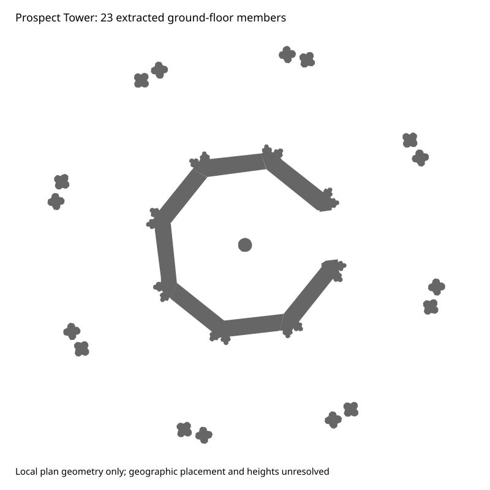

# Architectural components and Prospect Tower profiles

The new `architectural_components` generator builds multiple polygonal members at
independently evidenced vertical extents. It can represent columns, hollow walls,
balconies, stepped roof sections and other layered structures without filling the
whole building with a box. It is not an automatic facade/roof interpreter or a
continuous loft: each component is an explicit vertical extrusion.

A feature has a registered Point anchor in target coordinates and these parameters:

* `base_elevation_m`: absolute base level, with the terrain's vertical datum.
* `rotation_degrees`: local profile rotation counterclockwise from target east.
* `components`: a list of objects containing unique `id`, `geometry_source`, a
  local-metre Polygon/MultiPolygon `geometry`, and `parameters` for `bottom_m`,
  `top_m` and `material`. These nested parameters use the same value/source/status
  evidence records as other reconstruction parameters.

All three feature parameters also use evidence records. Local component profiles
must have accepted registration to their reviewed local frame; the anchor must
have accepted geographic registration. Offsets are relative to the base level.
Estimated values require `--allow-estimates`. No automatic terrain-derived base
level or guessed roof height is provided. Component profiles cannot exceed 100 m
from the anchor; per-feature and composition budgets remain active.

Polygons retain holes. Positive-area voxel intersection retains thin members,
with unavoidable one-block aliasing: sub-block columns can thicken and narrow
openings can disappear. Adjacent non-overlapping real members may overlap after
voxelization; different-material overlaps are withheld, not silently overwritten.
Native collisions or any invalid component roll back the entire structure.

## Real source extraction

`voxel_mapper/data/prospect-ground-profiles.json` contains **23 ground-floor
structural member footprints** from the retained existing-condition Prospect
Tower drawing AL3.02 Rev B, application SMD/2014/0841, December 2014. The upper
plan's grey fills were visually reviewed against the existing west elevation
AL3.06. Extraction excludes the lower ceiling/soffit view, paving annotations,
repair overlays, key, labels and title block. It preserves the inner void and
east-side opening, the separate outer columns and the central stair newel.



Reproduce using the retained PDF (requires the planning extra):

```sh
python scripts/extract_prospect_profiles.py \
  --pdf /absolute/path/SMD-2014-0841-89793.pdf \
  --output /new/path/prospect-ground-profiles.json
```

The script pins the source SHA256, the reviewed fill colour/view, a centre in PDF
points, and the printed 1:20 scale. It re-renders each selected vector path,
including curves and fill topology, at two pixels per paper point, then polygonizes
and simplifies by 5 mm in the local metric frame. It checks the expected 23-member
count and records source paths/areas. The included profiles are **not geographic
EPSG:27700 features**. Printed-scale conversion is not independently surveyed
accuracy, and existing 2014 geometry is not verified current/as-built geometry.

Vertical extents, geographic anchor/rotation, material-to-block choices and
restoration state remain unresolved. The JSON explicitly records unregistered
absolute placement and zero world additions. No replacement park world is
exported in this pass. The new generator's tests use synthetic, explicitly
registered fixtures, not claimed measured Alton geometry.

Source:
https://publicaccess.staffsmoorlands.gov.uk/portal/servlets/AttachmentShowServlet?ImageName=89793
