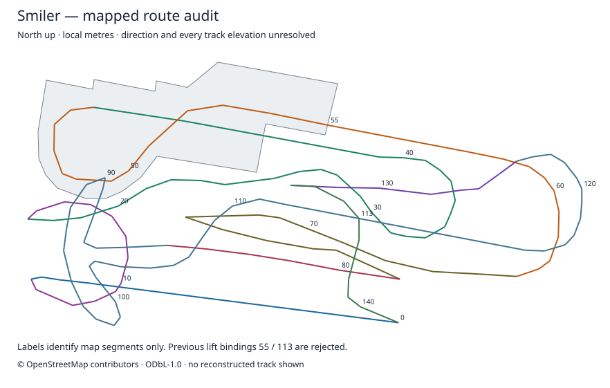

# Smiler reconstruction: rejected prototype and new evidence

The lift-only world failed visual review and is withdrawn. The old command now
refuses generation before reading source files or creating output. The old
`Alton_Towers_Smiler_Lift_Track_Pass.mcworld` remains a failed prototype; code
changes do not repair a previously downloaded world. Use the preceding
one-block Oblivion park as the reconstruction baseline.

The prototype assigned inclined lift segment 55 and vertical-lift foot after
segment 113 without accepted as-built registration. It also estimated each
lift rise from the published overall 30 m ride height. Its approaches, crests,
tower and excavation were guesses. Export readback tests checked storage,
not correspondence with the real ride. Those bindings and heights are rejected.

## New measured evidence

A matched Environment Agency survey pair was acquired for the Smiler footprint:
P_10682, surveyed **5 January 2022**, 1 m DTM and last-return DSM, EPSG:27700,
ODN heights. Both crops have 100% finite coverage. The datum transformation
uses the retained OSTN15 grid. Crops, archive hashes and observations are
retained in [the evidence directory](evidence/smiler-review/).

All 141 mapped segment-start terrain observations agree exactly with the
preceding park's terrain. This comparison finds no difference at those sampled
locations; it does not validate the terrain beneath every track branch.
The old estimated vertical-lift foot was 166 m ODN; terrain at its guessed
location is 174.303 m ODN. The draft therefore cut over eight metres below the
observed terrain at an unregistered location. Repeating that cut is unjustified.
Ground observations span 158.829–175.423 m ODN. DSM surfaces include roofs,
vegetation, supports and potentially track; they are not rail height controls.

The mapped route has **946.019 m plan length**, **141 segments** and **34
unresolved crossing pairs**. Topological ordering does not establish train
direction. The published 1,170 m track length is a 3D length and cannot be used
to scale the plan until the map and branch assignments are validated.



## Reproduce the audit

```bash
python -m voxel_mapper.smiler_reconstruction \
  --park-output /absolute/path/oblivion-one-block-track \
  --output /absolute/path/new-smiler-audit \
  --audit-only \
  --survey-pair /absolute/path/national-survey-pair.json
```

The survey argument is optional. The descriptor must reference acquired crops
and its verified datum grid. Output contains the route audit, local-coordinate
GeoJSON, SVG review map and, when supplied, surface observations. No track,
excavation, supports or world archive are emitted. Outputs are not overwritten.
GeoJSON coordinates are **local metres**, explicitly described by CRS WKT in
its metadata; they must not be interpreted as longitude/latitude.

Replacement geometry requires registered finished-ride references tied to
fixed site controls; a loading point and confirmed travel direction; identified
lift feet, crests, drops and brakes; and branch-specific elevations/roll through
all fourteen inversions and mapped crossings. None is marked accepted yet.
The existing station shell is also an estimated building envelope, not an
accurate station reconstruction.

## Reference limits

The retained proposed plan/elevation and manufacturer perspective remain useful
context, but have no accepted as-built registration. Manufacturer example
height/length differ from the finished ride. Public photographer lift pages and
the official POV were attempted again on 8 October 2026; retrieval failed and
their unseen contents were not used to bind geometry.

Environment Agency source tiles:
- [Dated terrain](https://environment.data.gov.uk/tiles/collections/survey/national_lidar_programme_dtm/2022/1/SK0540)
- [Dated last-return surface](https://environment.data.gov.uk/tiles/collections/survey/national_lidar_programme_dsm/2022/1/SK0540)

Contains Environment Agency information © Environment Agency and/or database
right, OGL-UK-3.0. Mapped geometry © OpenStreetMap contributors, ODbL-1.0.
