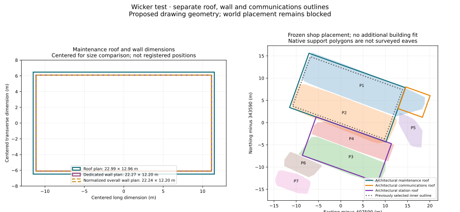

# Architectural roof/wall comparison

The revised architectural roof plan identifies a larger maintenance roof envelope than the outline selected in the first site comparison. The larger site candidate matches that architectural roof at **99.16% IoU / 0.076 m boundary Hausdorff distance** after a fixed-scale drawing correspondence derived solely from the shop. This is drawing agreement, not geographical accuracy.

## Separate source roles

| Outline | Proposed measured dimensions | Area | Source |
|---|---:|---:|---|
| Maintenance main roof | 22.99 × 12.96 m | 297.88 m² | 2967-48 P1, attachment 163940 |
| Maintenance outer walls | 22.27 × 12.20 m | 271.78 m² | 2967-42 P1, attachment 163939 |
| Maintenance overall-plan walls | 22.24 × 12.20 m | 271.26 m² | 2967-21 P1, attachment 163935; furniture scale correction |
| Communications roof | 5.79 × 5.17 m | 29.92 m² | 2967-48 P1 |
| Station main roof | 17.95 × 9.22 m | 165.49 m² | 2967-48 P1 |

These are manually sampled four-corner envelopes with a two-pixel endpoint bound. That bound describes drawing sampling, not physical positional uncertainty. Maintenance GIA 254 m² and communications GIA 18 m² are internal areas, not these external wall or roof areas.

The previously selected maintenance site polygon is 258.87 m², about 21.94 × 11.80 m. It is smaller than both reviewed external wall traces. Its exact line role remains unresolved; it must not automatically become a wall footprint. The larger candidate `9f75eb71c01873f01f5a4ffb62c24e1364518eab5253281ac1e996c1ff8d8652` is 296.86 m² and closely matches the architectural roof.

## Native comparison without refitting

Both half-turn drawing correspondences are retained. They have shop corner RMS residuals of 0.024 and 0.027 m. The second matches the labelled station/maintenance arrangement in the two drawings; the first puts them more than 55 m apart. Additional buildings are used for comparison only. No additional building changes the existing shop-derived geographical transform.

| Case | Native pair | IoU | Boundary Hausdorff distance |
|---|---:|---:|---:|
| Previously selected maintenance site outline | P1 + P2 | 73.94% | 5.715 m |
| Larger maintenance site outline | P1 + P2 | 82.99% | 5.191 m |
| Architectural maintenance main roof | P1 + P2 | 82.96% | 5.233 m |
| Architectural maintenance + communications roof union | P1 + P2 | 87.52% | 3.715 m |
| Architectural station main roof | P3 + P4 | 89.41% | 1.335 m |

The communication-roof hypothesis explains some of the eastern extension in P1, but does not establish which surveyed returns belong to which physical building. P1/P2 are convex native support envelopes, not surveyed eaves; their convex pair envelope bridges gaps. P5 remains a distinct low-slope patch outside the drawn communications roof position. Do not cut or stretch the native patches to match the drawings.

## Source acquisition and level caution

Three additional revised attachments were downloaded from links present in the checksum-pinned official SMD/2016/0315 application page: 163939 maintenance plans/elevations, 163938 preshow elevations and 163936 basement plan. Their URLs, dates, hashes and bounded acquisition results are retained in `evidence/wicker-architectural-extra-sources.json`. Only 163939 contributes new measurements in this review; the other two are acquired for subsequent review.

Maintenance elevation 2967-42 distinguishes inspection level +181.50, maximum level +183.745 and communications level 184.00. These proposed levels do not verify ODN. A bridge annotation combines a +185.80 label with numeric text 185400; retain that conflict rather than selecting a height automatically. No absolute height was promoted from this sheet.

## Reproduction

Run `scripts/acquire_wicker_site_sections.py` with `--attachment-ids 163939 163938 163936`, the retained application page and a fresh output directory. Every selected ID must exist in that page; the cap is 32 distinct IDs and four concurrent requests.

Run `scripts/review_wicker_architectural_outlines.py` using the three hash-addressed architectural PDFs, the revised site PDF, annotations, existing floor-scale review, frozen site review and roof-plane correspondence receipt. The script verifies source checksums, exact rendered pixels, floor correction scope and linked evidence before comparing at fixed printed scale. `scripts/plot_wicker_architectural_outlines.py` generates the SVG.

Validation records deterministic replay, scale preservation, direct measurement reproduction, source integrity and focused roof pipeline checks in `evidence/wicker-architectural-outline-validation.json`.

**Accepted controls: 0. Accepted independent checkpoints: 0. World geometry additions: 0.** Remaining work is to resolve the communications/extension identity against a suitably precise independent reference, establish independent checkpoints and drawing vertical datum, and then rerun the placement gates.
