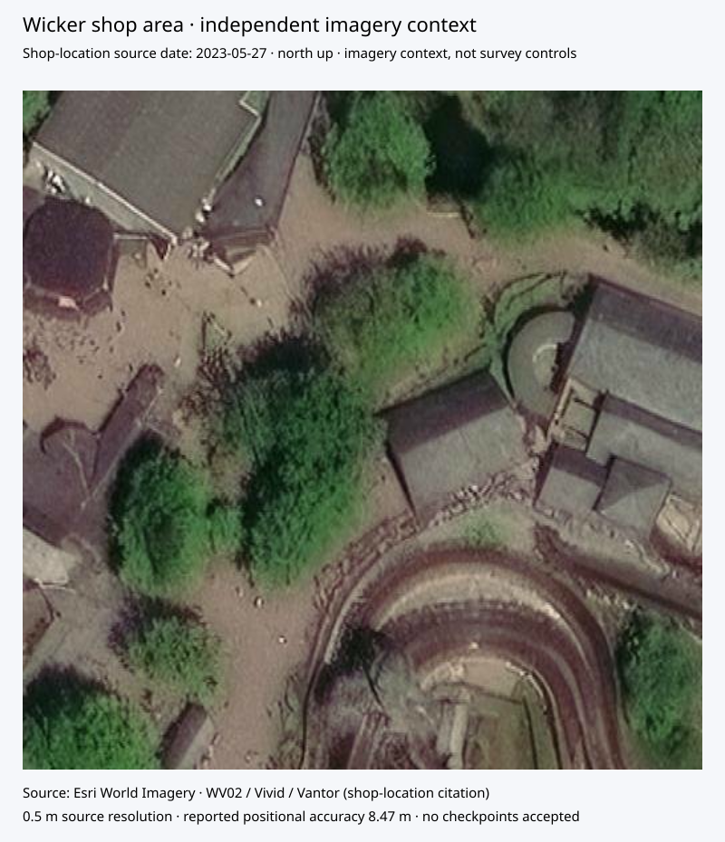

# Independent dated imagery acquired



Four adjacent level-19 Esri World Imagery tiles now cover the shop/ride-building
context in a north-up review view. Original JPEG bytes are embedded unchanged in
the SVG. Each tile retains its URL, checksum, row/column, EPSG:3857 bounds and
pixel-to-map transform derived from the service's tile origin/resolution.
This is a small context acquisition, not a bulk imagery downloader.

The citation query at the shop point (-1.8888, 52.98955) reports source acquisition
date 27 May 2023, WV02/Vivid imagery, Vantor description, 0.5 m source resolution,
0.3 m sampling resolution and 8.47 m positional accuracy. Its basemap release is
Raster Basemaps 2026.R03; publication/release is not image capture date. Metadata
was queried at the shop point only; its date is not asserted independently for
every surrounding tile pixel. Queries of the three applicable coarser citation
layers returned the same record; the 15 cm layer returned no feature.

The independent view is available for checking visible building relationships
and the proposed rear structure. It is not accurate enough to supply 1 m
registration checkpoints. Georeferencing, display sampling or enlargement cannot
reduce its recorded 8.47 m positional uncertainty. Roof pixels also are not
surveyed ground-wall corners. No control, checkpoint, canopy identity or
geographic placement is accepted from this acquisition.

The current service's map export returned a zero-size result, so the source view
uses four observed cache-tile responses instead. The previous EA aerial index
returned no coverage, but this separate provider supplied imagery; that earlier
negative query did not imply universal absence.

## Replay

Download the four URLs in `evidence/wicker-shop-imagery-context.json` as
`esri-19-<row>-<column>.jpg`. Retain the World Imagery service metadata as
`esri-current.json` and the shop-point layer-9 query response as
`shop-esri-citation-9.json`. These live sources can change: compare the retained
hashes before treating a later acquisition as the same image.

```sh
python scripts/retain_wicker_imagery.py --directory imagery-inputs \
  --output imagery-receipt.json --svg imagery-context.svg
```

Validation covers byte-identical receipt/SVG replay, JPEG dimensions and hashes,
contiguous adjacent tile georeferencing, separate acquisition/release dates,
metadata scope and retention of the failed positional-accuracy gate. The view
was rendered and visually reviewed. The proposed model and registration gates
remain unchanged; zero world geometry is placed.

Next: inspect and annotate physical rear/entrance relationships in this independent
view, then seek higher-accuracy independent imagery or survey coordinates for
placement checkpoints. Use this view as contextual evidence only.
