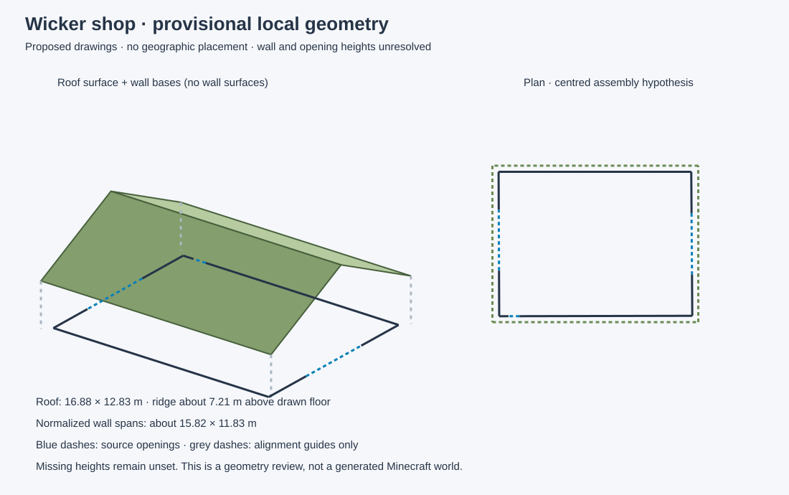

# Local roof and floor preview



The normalized floor trace and proposed main roof now share one local metric
preview frame. The long wall axis is aligned to the roof's long axis and the
wall outline is centred under the roof. This is an explicit assembly hypothesis;
source correspondence under a 180-degree reversal and actual roof/wall centring
remain unresolved. No geographic coordinates are assigned.

The preview contains the four-triangle roof surface, seven wall-base segments
and three opening-base segments. Blue dashed lines show source openings. Grey
dashed lines are roof-to-ground alignment guides only. No wall or opening height
is assigned; no wall surfaces, doorway lintels or Minecraft blocks are invented.
The roof appears above an open base outline because those missing surfaces are
intentionally withheld.

Under the centring hypothesis, the roof covers the normalized outline with
roughly half-metre margins. Those calculated margins describe the local assembly;
they are not independently measured physical overhangs. Floor distances are
preserved by an orthonormal local transform, without stretching the wall trace
to the roof. Raw and normalized source traces remain unchanged.

```sh
python scripts/preview_wicker_shop.py \
  --scale-review evidence/wicker-shop-floor-scale-review.json \
  --roof-review evidence/wicker-shop-local-roof.json \
  --output local-preview.json --svg local-preview.svg
```

`evidence/wicker-shop-local-preview.json` retains the alignment hypothesis,
transform basis, roof mesh, wall/opening bases, calculated margins, input hashes
and unresolved fields. `wicker-shop-local-preview-validation.json` records
byte-identical JSON/SVG replay, rigid distance preservation, centred roof
coverage, rejection of conflicting scale reviews or changed roof inputs, and
withholding of unknown-height surfaces. The SVG was rendered and visually
reviewed. No world geometry is placed.

Next: recover source-supported wall/gable and opening heights, add the small
roof projection, and compare roof position/orientation hypotheses with dated
LiDAR. Geographic registration still needs independent physical evidence.
