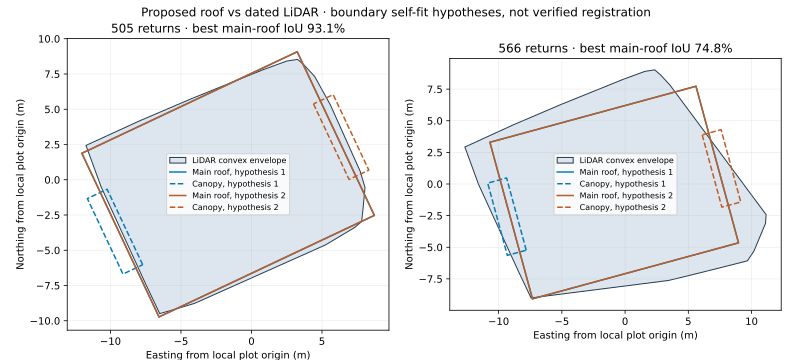

# Proposed shop model compared with dated LiDAR



The combined local roof/canopy model has been compared with the January 2022
P_10682 native building returns. Each retained envelope is reconstructed from
original crop point indices; cloud, crop receipt, membership and survey bindings
are checked. Two opposite main-roof orientations remain equivalent for the
stable 505-return envelope. The 566-return expanded envelope retains four
near-equivalent transforms; the plot shows the leading opposite pair only.

| Diagnostic | Stable 505-return envelope | Expanded 566-return envelope, leading fit |
| --- | ---: | ---: |
| Main-roof footprint overlap (IoU) | 93.14% | 74.77% |
| Main-roof boundary Hausdorff distance | 0.847 m | 2.690 m |
| Main-roof returns inside proposed roof | 469 | 430 |
| Self-fitted floor offset | approximately 182.647 m ODN | approximately 182.547 m ODN |

The stable main-roof vertical profile has approximately 0.046 m median absolute
residual and 0.125 m 95th-percentile absolute residual after a floor-offset
self-fit. The offset is estimated from main-roof returns only. Its closeness to
the proposed 182.50 m floor label does not establish the label's ODN datum.
The stable fit still exceeds the existing relative boundary-agreement gate;
`poor_boundary_agreement` is retained rather than relaxed.

## Canopy is not corroborated

The stable hypotheses cover zero or five returns in the canopy-only footprint.
Those five returns have a median vertical residual approximately +3.31 m above
the proposed canopy using the main-roof floor offset. Expanded-envelope
hypotheses cover zero, twelve or fourteen canopy-only returns; the covered
returns are also approximately 3.6–3.8 m above the proposed canopy on median.
Horizontal inclusion is therefore not evidence identifying canopy returns.
The point cloud does not corroborate this proposed canopy or select a unique
orientation in this review. Sparse coverage, construction changes and source
interpretation remain possible explanations; none is asserted as established.

Every return is partitioned into main-roof, canopy-only or outside-both indices.
The report retains all partitions and the canopy residual separately. A canopy
return cannot influence the main-roof floor-offset fit. Horizontal transforms
reuse the fitted envelope and vertical residuals reuse the same returns; neither
is an independent registration checkpoint.

```sh
python scripts/compare_wicker_model_lidar.py \
  --model evidence/wicker-shop-projection-model.json \
  --cloud ea-point-cloud.las --roof-report evidence/wicker-roof-candidates.json \
  --crop-receipt evidence/wicker-point-cloud-crop.json --output model-lidar.json
python scripts/plot_wicker_model_lidar.py --review model-lidar.json --output review.svg
```

Evidence is `wicker-shop-model-lidar-review.json`; validation is
`wicker-shop-model-lidar-validation.json`. Checks cover deterministic replay,
native envelope reproduction, disjoint/exhaustive return partitions, rejection
of invalid provenance indices, preservation of ambiguity and poor-boundary
flags, and three existing focused roof-scale tests. The plot was rendered and
visually reviewed. Zero controls/checkpoints are accepted and zero world
geometry is placed.

Next: investigate physical canopy identity and the orientation context using
separately sourced evidence. Use the stable main roof as a provisional comparison
candidate, not accepted placement; obtain independent physical registration
controls/checkpoints before geographic world generation.
