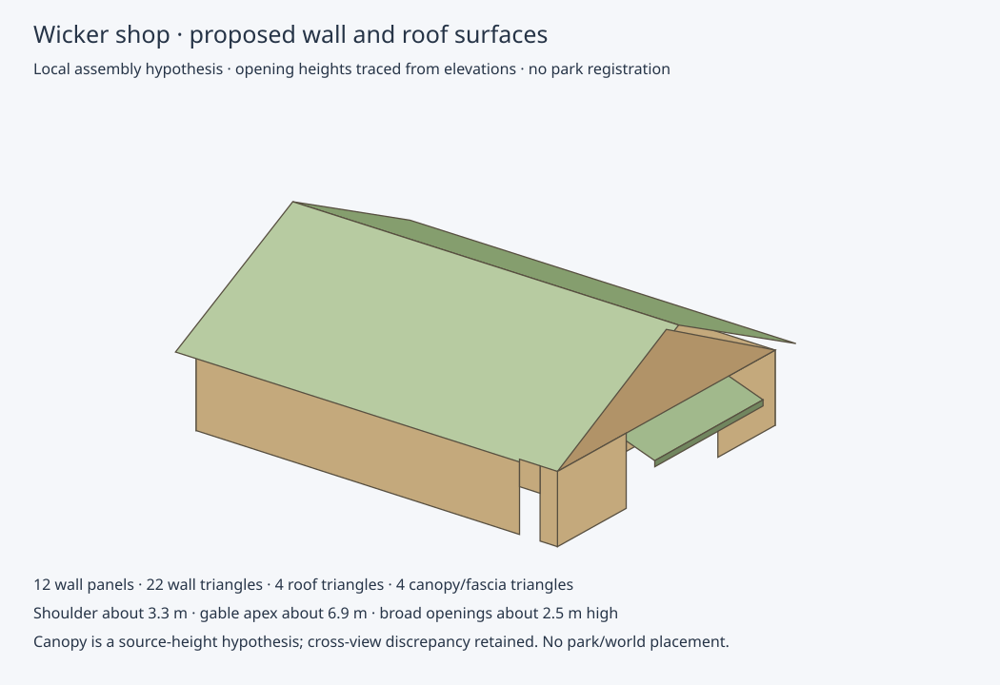

# Provisional canopy roof and front fascia



The proposed local shop model now includes a four-triangle canopy assembly:
two roof-surface triangles and two front-fascia triangles. Plan traces supply
its approximately 5.92 m width and roughly 1 m extension beyond the main roof.
The rear attachment extends under the main-roof overhang to the northeast wall,
so wall-to-front depth is approximately 1.5 m. That attachment is an explicit
local hypothesis, not an independent measurement of hidden construction.

A close side-view rendering distinguishes upper roof and lower fascia edges.
The northeast elevation gives roof rear height approximately 3.34 m, front upper
edge 2.76 m and front fascia bottom 2.49 m above the drawn floor. Front fascia
height is approximately 0.27 m. This matches the northeast opening head directly.
The proposed local roof slope is approximately 21 degrees under the attachment
hypothesis; it is not a figured design angle.

The southeast upper front edge traces to approximately 2.45 m above its drawn
floor, about 0.31 m below the northeast trace. Both raw heights are retained.
Although that difference is below the combined two-view sampling bound of
approximately 0.36 m, the northeast central value does not lie within the side
trace's individual sampling interval. The preview explicitly chooses northeast
heights to preserve that view's entrance/fascia relationship; it does not claim
a uniquely resolved roof profile or average the two views into physical truth.

Only the front fascia is meshed. Side fascia, roof thickness, wall thickness,
construction joints and bunding remain unresolved. The existing roof/wall
centring and 180-degree source correspondence are still local hypotheses.
The mesh is not watertight, geographically registered or eligible for accepted
world placement. Colours are illustrative surface distinctions.

```sh
python scripts/build_wicker_shop_projection.py \
  --pdf-directory shop-pdfs --walls evidence/wicker-shop-wall-model.json \
  --output projection-model.json
python scripts/render_wicker_shop_walls.py \
  --model projection-model.json --reverse --output projection-preview.svg
```

The model retains source hashes, fixed rendered pixel hashes, all side/front
point picks, native transforms, roof-plan alignment, the explicit height choice
and raw cross-view discrepancy. Validation covers deterministic JSON/SVG replay,
nondegenerate triangles, fascia/opening-head consistency, retention of unresolved
registration, and unchanged replay of the previous wall preview. The new view
was rendered and visually reviewed. Zero world geometry is placed.

Next: compare the combined roof footprint and vertical profile with dated LiDAR,
retaining orientation hypotheses and proposed/as-built uncertainty. Independent
physical registration checks remain necessary for verified park placement.
