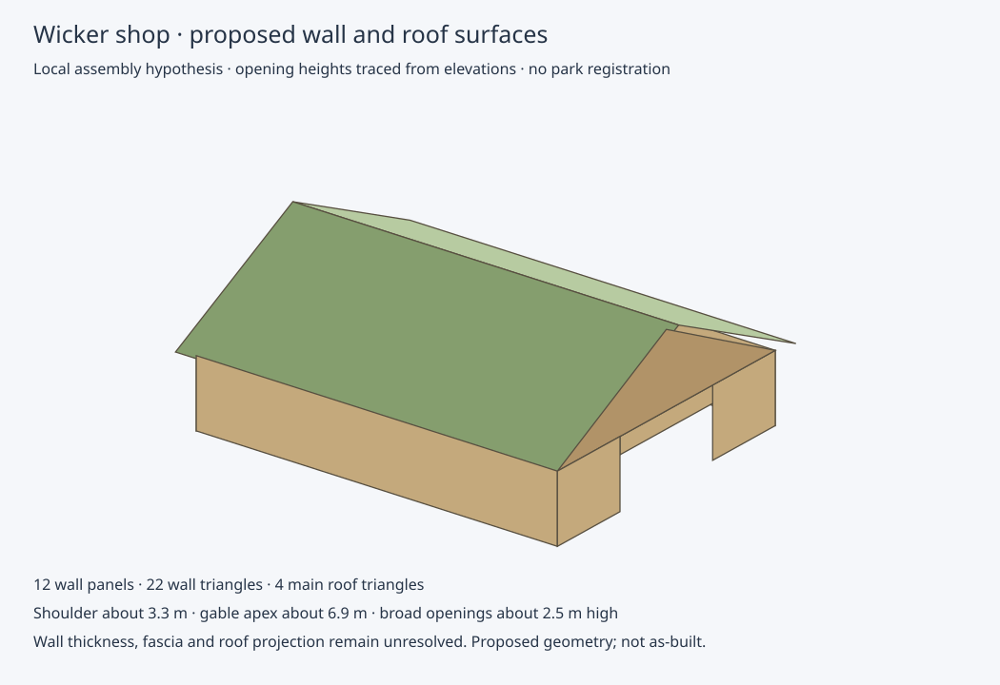

# Proposed vertical shop geometry



The local model now contains twelve wall panels (22 triangles) as well as the
four-triangle main roof. Seven panels follow the solid wall-base segments;
three lintel panels bridge above the traced openings; two triangular gables
complete the end walls. No wall panel fills a doorway below its traced head.

Manual elevation traces are pinned to the PDF checksum and full-page render
pixel hash. Each endpoint has ±2 pixel sampling bounds; two-endpoint heights
therefore have approximately ±0.18 m worst-case sampling intervals. These are
sampling bounds, not physical accuracy or as-built confidence.

| Trace | Height above drawn shop floor |
| --- | ---: |
| Wall shoulders across four views | approximately 3.16–3.30 m |
| Underside main timber gable apex | approximately 6.86–6.90 m |
| Broad southwest opening | approximately 2.49 m |
| Broad northeast opening | approximately 2.49 m |
| Northwest side door | approximately 2.09 m |

The preview uses the southwest shoulder (3.30 m) and underside gable apex
(6.86 m) as representative connected wall heights. The other traces contain
those values within their recorded sampling intervals. Roof exterior heights
remain distinct from timber wall/gable heights. Fascia or thickness is not
inferred from their difference.

Opening-to-wall assignment follows the floor-plan/elevation view associations
as a local hypothesis: southwest and northeast broad openings and northwest
side door. The small door visible beside the northeast projection is not
silently substituted for the northwest door. Its relationship to the side-door
levels requires further investigation. The northern roof projection itself has
not been meshed because its depth and attachment need plan-view tracing.

Roof and walls retain the centred local assembly hypothesis. Handedness under
180-degree source correspondence, proposed-vs-as-built identity, geographic
bearing, park position and the floor's ODN relationship remain unverified. Wall
thickness, interior partitions, bunding and material/block assignments are
unset. Preview colours distinguish surfaces and are not verified materials.
The shell is not watertight and is not eligible for accepted world placement.

```sh
python scripts/build_wicker_shop_walls.py \
  --pdf shop-elevations.pdf \
  --annotations evidence/wicker-shop-vertical-annotations.json \
  --preview evidence/wicker-shop-local-preview.json \
  --output wall-model.json
python scripts/render_wicker_shop_walls.py --model wall-model.json --output preview.svg
```

Evidence retains every raw/native vertical trace, input hashes, representative
height choices, wall panels, triangles and opening heights. Validation checks
byte-identical replay, nondegenerate triangles, wall area equal to the full
wall-and-gable shell minus openings, cross-view interval agreement, and rejection
of overheight openings or stale render annotations. The SVG was rendered and
visually reviewed. Zero world geometry is placed.

Next: trace the small roof projection in plan/elevation, then compare the local
roof with dated LiDAR position/orientation hypotheses. Independent physical
registration evidence remains necessary for verified park placement.
